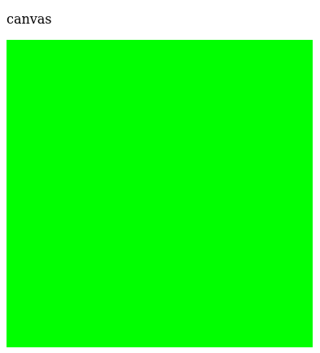
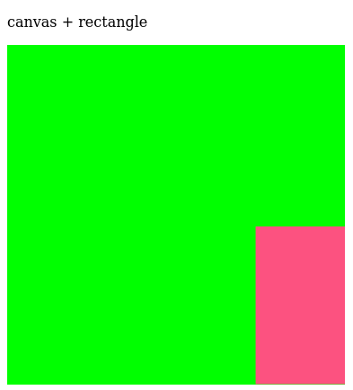
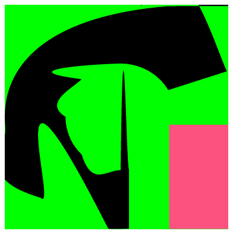
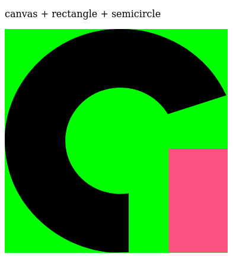
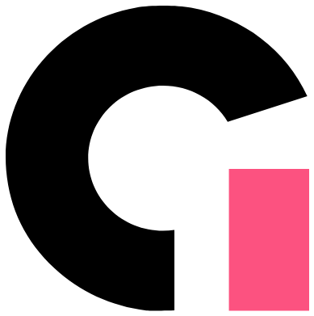

# ingate-educa-logo

## About this repository

This repository is a project for javascript canvas practicing only.

## The (re)creation process

First, I tried to draw a semicircle using the `CanvasRenderingContext2D.arc()` method. However, the logo is not a perfect circle based, the logo is a little bit elliptic.

Thus, I decided that the best way could be the `CanvasRenderingContext2S.bezierCurveTo()` method. This method adds a cubic Bézier curve to the current sub-path. It's like drawing in the Paint Brush, but without brush tool lol. For this, we need only three points: the first two are control points (that generally don't lie on the curve) and the third one is the end point. The starting point is the latest point in the current path, which can be changed using `moveTo()` before creating the Bézier curve.

After I decide using this feature, I started with the background and the rectangle. Afterwards I went point by point and adjusted the Bézier curve around to form the letter "G" (or C, I don't know what kind of letter it is, but I think it's a mix of G and E).

The background was drawn in green with fixed width and height.

 
 

After many attempts I finally drew the rectangle with the width and height to scale with respect to the canvas background. The rectangle colour was obtained by checking the original Ingate logo and analysed in the Paint Online with dropper tool.

 
 

The letter C (or G) was built almost checking the position x and y one by one. Sometimes aberrations appear, the letter became in horrible shape.

 
 

But rounding each Bézier curve using a pocket calculator finally it gets the final shape.

 
 

Applying the white colour to the background finally we have the _Ingate Educa_ logo.

 
 

### About the logo

The logo is an [Ingate Educa](https://ingate.app) trademark.

### Logo Copyright

The right of commercial use of the brand belongs to [Ingate Educa](https://ingate.app) and needs the authorization [Yoannes Geissler](https://github.com/yoannes).
